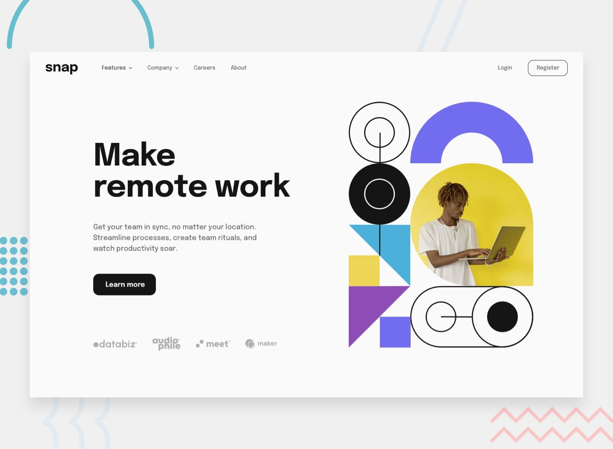

# 🔽 Intro Section with Dropdown Navigation



Projeto desenvolvido como parte do meu treinamento em **HTML, CSS, JavaScript e Bootstrap 5**, a partir de um desafio do [Frontend Mentor](https://www.frontendmentor.io).

<div align="center">

### 🔗 [**Ver site ao vivo**](https://anaclarissi.github.io/dropdown-navigation/)

</div>

---

## 📋 Sobre o projeto

Este é um projeto de **treinamento e prática**, com o objetivo de aprimorar minhas habilidades de front-end construindo interfaces reais a partir de um design de referência. O desafio consistia em recriar uma seção de introdução com menu de navegação dropdown, cuidando de responsividade, acessibilidade e estados de interação.

- 🎯 **Desafio original:** [Intro section with dropdown navigation](https://www.frontendmentor.io/challenges/intro-section-with-dropdown-navigation-ryaPetHE5)
- 👤 **Meu perfil no Frontend Mentor:** [@anaClarissi](https://www.frontendmentor.io/profile/anaClarissi)
- 🌐 **Site publicado:** [anaclarissi.github.io/dropdown-navigation](https://anaclarissi.github.io/dropdown-navigation/)

---

## 📸 Preview

<table>
  <tr>
    <td align="center"><strong>Desktop</strong></td>
    <td align="center"><strong>Mobile</strong></td>
  </tr>
  <tr>
    <td></td>
    <td></td>
  </tr>
</table>

---

## ✅ Funcionalidades

Os usuários conseguem:

- Visualizar os menus dropdown relevantes tanto no desktop quanto no mobile ao interagir com a navegação
- Ver o layout ideal do conteúdo de acordo com o tamanho de tela do dispositivo
- Perceber estados de hover em todos os elementos interativos da página

---

## 🛠️ Construído com

- HTML5 semântico
- CSS3 (variáveis customizadas, `clamp()`, Flexbox)
- [Bootstrap 5](https://getbootstrap.com/) — componente de navegação e dropdown
- Design **mobile-first**
- Media queries com unidades relativas (`em`) para melhor acessibilidade

---

## 🎓 O que eu aprendi

Este projeto foi uma ótima oportunidade para aprofundar conceitos importantes de front-end. Alguns dos principais aprendizados:

### 📐 Tipografia fluida com `clamp()`
Substituí múltiplos breakpoints de `font-size` por uma única linha de CSS, permitindo que o texto escale suavemente entre um tamanho mínimo e máximo:

```css
.title {
    font-size: clamp(2rem, calc(-0.534rem + 10.811vw), 2.25rem);
}
```

### 📏 `em` vs `px` em media queries
Aprendi por que unidades relativas (`em`) são preferíveis a `px` nos breakpoints — elas respeitam configurações de acessibilidade do usuário, como o aumento do tamanho de fonte no navegador.

```css
@media (min-width: 60em) { ... }
```

### 📌 `position: sticky` vs `position: fixed`
Entendi por que `sticky` é geralmente a escolha mais robusta para headers de navegação, já que mantém o elemento no fluxo do documento e evita problemas de sobreposição de conteúdo, sem precisar de ajustes manuais de `padding`.

```css
#header {
    position: sticky;
    top: 0;
    z-index: 100;
}
```

### 🎨 Customizando componentes do Bootstrap
Aprendi a sobrescrever estilos de componentes do Bootstrap (navbar, dropdown, botões) via CSS próprio, aproveitando a ordem de carregamento dos arquivos e, quando necessário, utilizando as variáveis internas do Bootstrap (`--bs-*`) em vez de brigar com a especificidade dos seletores.

### 🍔 Menu mobile customizado
Estilizei o comportamento padrão do `navbar-toggler` e `collapse` do Bootstrap para criar um menu lateral (off-canvas) customizado, incluindo a troca de ícones (menu/fechar) via CSS.

---

## 🚀 Como rodar o projeto localmente

```bash
# Clone o repositório
git clone https://github.com/anaClarissi/dropdown-navigation.git

# Acesse a pasta do projeto
cd dropdown-navigation

# Abra o index.html no navegador
```

---

## 📬 Contato

- Linkedin: [Ana Clarissi](https://www.linkedin.com/in/anaclarissi)

- Frontend Mentor: [@anaClarissi](https://www.frontendmentor.io/profile/anaClarissi)

---

<div align="center">

Feito com 💜 durante meus estudos de front-end.

</div>